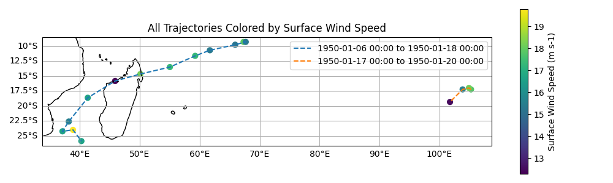

Output File Format
==================

One of the key features of TCTrack is its output file format.
Whilst all of the codes wrapped provide output data in a custom formats with
minimal or zero metadata, TCTrack, by contrast, provides data in a standardised results
format across all codes that is compliant with the
`CF-Conventions <https://cfconventions.org/>`_ for metadata.

These pages describe the contents of this file and how it can be used downstream.

.. Import the tempest_extremes module to use references throughout this page.
.. py:module:: tctrack.core
   :no-index:

CF-Conventions and FAIR Data
----------------------------

The `CF (Climate and Forecast) Conventions for NetCDF data <https://cfconventions.org/>`_
are best introduced in their own words:

    *"The CF metadata conventions are designed to promote the processing and sharing of
    files created with the NetCDF API. The conventions define metadata that provide a
    definitive description of what the data in each variable represents, and the spatial
    and temporal properties of the data. This enables users of data from different
    sources to decide which quantities are comparable, and facilitates building
    applications with powerful extraction, regridding, and display capabilities."*

TCTrack produces CF-compliant files for all tracking algorithms with clear
metadata.

`FAIR <https://www.go-fair.org/fair-principles/>`_ is an acronym for
Findable, Accessible, Interoperable, and Reusable.
It outlines expectations for high-quality metadata and standards-compliant file formats.
By providing clear variable definitions, provenance information, and following
established conventions, such datasets enable robust scientific workflows, reproducibility,
and integration into a wide range of analysis tools.
This approach maximizes the scientific value of the data and supports transparent,
collaborative research. It also ensures that datasets and files are meaningful, useable,
and reliable, even when shared standalone or a significant time after generation.

Overview
--------

Each NetCDF output file produced by the :meth:`~TCTracker.to_netcdf` method of a Tracker
contains a collection of tropical cyclone trajectories, with each trajectory representing
a single storm track.

The format follows the
`CF Conventions: H4 Trajectory Data <https://cfconventions.org/cf-conventions/cf-conventions.html#trajectory-data>`_
recommendations for trajectory data using two-dimensional arrays of
shape ``(n_trajectory, n_observation)``.
Any trajectories shorter than ``n_observations`` end with fill values.

File Format
-----------

Dimensions
^^^^^^^^^^

- **trajectory**: Number of detected storm tracks (each a unique trajectory).

  - Has a corresponding dimension coordinate variable indicating the trajectory index

- **observation** Maximum number of time steps (observations) in the trajectories.
    
  - Has a corresponding dimension coordinate variable indicating the observation index

Variables
^^^^^^^^^

Required variables
""""""""""""""""""

These coordinate variables are always present in a dataset:

- **trajectory**: Unique index for each trajectory.

  - *Dimensions*: ``(trajectory)``
  - Dimension coordinate.
  - Designated by the ``cf_role="trajectory_id"`` *attribute*.

- **observation**: Index for each observation within a trajectory.

  - *Dimensions*: ``(observation)``
  - Dimension coordinate.

- **time**: Time of each observation.

  - *Dimensions*: ``(trajectory, observation)``
  - Auxiliary coordinate.
  - *Attributes* include ``units`` and ``calendar`` amongst others

- **lat**: Latitude of the observation.
  
  - *Dimensions*: ``(trajectory, observation)``
  - Auxiliary coordinate.

- **lon**: Longitude of the observation.
  
  - *Dimensions*: ``(trajectory, observation)``
  - Auxiliary coordinate.

Optional variables
""""""""""""""""""

A number of additional variables may also be written to file for each trajectory
depending on the algorithm, data used, and user-configuration.
Most commonly these will be measures of "intensity" along the tracks, but may also include
auxilliary coordinates such as grid indices.

- **Intensity variables**

  - *Dimensions*: ``(trajectory, observation)``
  - *Attributes* should include ``units`` and may also provide a
    `CF cell method <https://cfconventions.org/Data/cf-conventions/cf-conventions-1.12/cf-conventions.html#data-model-cell-method>`_
    indicating how the variable was calculated.

Ancillary Field Variables
"""""""""""""""""""""""""

Files always include two
`Ancillary status flag variables <https://cfconventions.org/Data/cf-conventions/cf-conventions-1.12/cf-conventions.html#ancillary-data>`_:

- **start_flag**

  - *Dimensions*: ``(trajectory)``

- **end_flag**

  - *Dimensions*: ``(trajectory)``

These indicate any tracks that start or end within 1 day of the input dataset bounds
and may therefore extend outside this range.

Global Attributes
^^^^^^^^^^^^^^^^^

Files contain a number of global metadata attributes 

- **Conventions**: Indicates the version of the CF-conventions the file was generated
  with
- **featureType**: ``trajectory``, a CF attribute aiding data processing and regognition of data format
- **tctrack_version**: Attribute detailing the software version used to generate the file.
  Indicates semantic version and commit hash.
- **tctrack_tracker**: Tracker name identifying the algorithm used (e.g., TSTORMSTracker)
- **<TCTrack-Tracker>_parameters**: JSON-encoded dictionaries recording all key parameters used for detection and tracking, to aid reproducibility.

Inspection and Usage
--------------------

As a CF-compliant NetCDF file TCTrack outputs can be accessed using a number of downstream tools and softwares including NetCDF-Python, xarray, cf-python etc. both within and
beyond the Python ecosystem.

Perhaps the quickest way of inspecting the metadata is to use the
`ncdump utility <https://docs.unidata.ucar.edu/nug/current/netcdf_utilities_guide.html>`_:

.. code-block:: shell

     ncdump -h my_tctrack_output.nc

::

    netcdf my_tctrack_output {
    dimensions:
            trajectory = 2 ;
            observation = 13 ;
    variables:
            int64 trajectory(trajectory) ;
                    trajectory:standard_name = "trajectory" ;
                    trajectory:cf_role = "trajectory_id" ;
                    trajectory:long_name = "trajectory index" ;
            int64 observation(observation) ;
                    observation:standard_name = "observation" ;
                    observation:long_name = "observation index" ;
            double time(trajectory, observation) ;
                    time:standard_name = "time" ;
                    time:long_name = "time" ;
                    time:units = "days since 1950-01-01 12:00:00.000000" ;
                    time:missing_value = -100000000. ;
                    time:calendar = "360_day" ;
            double lat(trajectory, observation) ;
            ...

Here we show how to inspect a file using cf-python which highlights the structure
described above:

.. code-block:: python

    import cf

    # Read the input file. This automatically concatenates in time.
    fieldlist = cf.read("my_tctrack_output.nc")

    for field in fieldlist:
        field.dump()

::

    ------------------------------------------------------------------
    Field: air_pressure_at_sea_level (ncvar%air_pressure_at_sea_level)
    ------------------------------------------------------------------
    Conventions = 'CF-1.12'
    detect_parameters = '{"u_in_file": "u_ref_interpolated_final.nc", "v_in_file":
                         "v_ref_interpolated_final.nc", "vort_in_file":
                         "vort850_interpolated_final.nc", "tm_in_file":
                         "tm_interpolated_final.nc", "slp_in_file":
                         "slp_interpolated_final.nc", "use_sfc_wind": true,
                         "vort_crit": 3.5e-05, "tm_crit": 0.0, "thick_crit": 50.0,
                         "dist_crit": 4.0, "lat_bound_n": 70.0, "lat_bound_s":
                         -70.0, "do_spline": false, "do_thickness": false}'
    featureType = 'trajectory'
    long_name = 'Sea Level Pressure'
    missing_value = np.float64(-10000000000.0)
    standard_name = 'air_pressure_at_sea_level'
    stitch_parameters = '{"r_crit": 900.0, "wind_crit": 17.0, "vort_crit": 3.5e-05,
                         "tm_crit": 0.5, "thick_crit": 50.0, "n_day_crit": 2,
                         "do_filter": true, "lat_bound_n": 40.0, "lat_bound_s":
                         -40.0, "do_spline": false, "do_thickness": false}'
    tctrack_tracker = 'TSTORMSTracker'
    tctrack_version = '0.1.dev157+g482a888b7'
    tstorms_parameters = '{"tstorms_dir": "/home/jwa34/rds/hpc-
                          work/TSTORMS_clean/tropical_storms_pub/", "output_dir":
                          "/home/jwa34/rds/rds-inspire-tc-
                          TqEGHMWTn8A/test_data/tstorms/output_test/", "input_dir":
                          "/rds/project/rds-TqEGHMWTn8A/test_data/tstorms"}'
    units = 'Pa'

    Data(trajectory(2), observation(13)) = [[1002.11, ..., nan]] Pa

    Cell Method: area: maximum (lesser circle of radius 4.0 degrees)

    Field Ancillary: status_flag
        long_name = 'Trajectory starting at start of dataset flag.'
        standard_name = 'status_flag'
        Data(trajectory(2)) = [0, 0]

    Field Ancillary: status_flag
        long_name = 'Trajectory finishing at end of dataset flag.'
        standard_name = 'status_flag'
        Data(trajectory(2)) = [0, 0]

    Domain Axis: observation(13)
    Domain Axis: trajectory(2)

    Dimension coordinate: trajectory
        cf_role = 'trajectory_id'
        long_name = 'trajectory index'
        standard_name = 'trajectory'
        Data(trajectory(2)) = [0, 1]

    Dimension coordinate: observation
        long_name = 'observation index'
        standard_name = 'observation'
        Data(observation(13)) = [0, ..., 12]

    Auxiliary coordinate: time
        calendar = '360_day'
        long_name = 'time'
        missing_value = np.float64(-100000000.0)
        standard_name = 'time'
        units = 'days since 1950-01-01 12:00:00.000000'
        Data(trajectory(2), observation(13)) = [[1950-01-06 00:00:00, ..., -275828-03-21 12:00:00]] 360_day

    Auxiliary coordinate: lat
        long_name = 'latitude'
        missing_value = np.float64(-999.9)
        standard_name = 'lat'
        units = 'degrees_north'
        Data(trajectory(2), observation(13)) = [[-9.26, ..., nan]] degrees_north

    Auxiliary coordinate: lon
        long_name = 'longitude'
        missing_value = np.float64(-999.9)
        standard_name = 'lon'
        units = 'degrees_east'
        Data(trajectory(2), observation(13)) = [[67.32, ..., nan]] degrees_east

    ...

Plotting example
----------------

Tracks can be visualised using variety of softwares.
Here we demonstrate a simple example using NetCDF with cartopy, though users may also
explore cf-python, xarray, or `hurucanpy <https://huracanpy.readthedocs.io>`_.

.. code-block:: python

    import netCDF4
    import numpy as np
    import matplotlib.pyplot as plt
    import cartopy.crs as ccrs

    # Open the NetCDF file
    with netCDF4.Dataset("my_tctrack_output.nc") as ncfile:
        # Read variables
        lat_var = ncfile.variables["lat"]
        lon_var = ncfile.variables["lon"]
        time_var = ncfile.variables["time"]
        intensity_var = ncfile.variables["wind_speed"]
        traj_var = ncfile.variables["trajectory"]

        lats = lat_var[:]
        lons = lon_var[:]
        intensity = intensity_var[:]
        traj_labels = traj_var[:]
        times = time_var[:]

        # Convert times to datetime objects
        missing_time = getattr(time_var, "missing_value", np.nan)
        times = np.ma.masked_where(times == missing_time, times)
        time_units = getattr(time_var, "units")
        time_calendar = getattr(time_var, "calendar")
        times_dt = netCDF4.num2date(times, units=time_units, calendar=time_calendar)

        # Get intensity metadata for labels
        intensity_name = getattr(intensity_var, "long_name")
        intensity_units = getattr(intensity_var, "units", "")
        min_intensity = np.nanmin(intensity)
        max_intensity = np.nanmax(intensity)

        plt.figure(figsize=(10, 6))
        ax = plt.axes(projection=ccrs.PlateCarree())
        ax.coastlines()
        ax.gridlines(draw_labels=True)

        # Plot each trajectory
        for i in traj_labels:
            times_i = times_dt[i, :].compressed()
            label = (
                f"{times_i[0].strftime('%Y-%m-%d %H:%M')} to "
                f"{times_i[-1].strftime('%Y-%m-%d %H:%M')}"
            )
            pl = ax.plot(
                lons[i], lats[i], "--", transform=ccrs.PlateCarree(), label=f"{label}"
            )
            sc = ax.scatter(
                lons[i],
                lats[i],
                c=intensity[i],
                cmap="viridis",
                s=40,
                vmin=min_intensity,
                vmax=max_intensity,
                transform=ccrs.PlateCarree(),
            )

        plt.colorbar(sc, label=f"{intensity_name} ({intensity_units})")
        plt.title(f"All Trajectories Colored by {intensity_name}")
        plt.legend()
        plt.savefig("my_tracks.png")

References
----------

- `CF Conventions: Trajectory Data <https://cfconventions.org/cf-conventions/cf-conventions.html#trajectory-data>`_
- `FAIR Data on go-fair.org <https://www.go-fair.org/fair-principles/>`_
